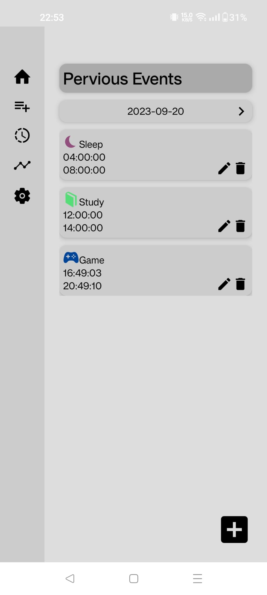

# timePlannerApp
This is a time planner app by React Native for record what you have done in one day.
This idea is based on the time managment method of Alexander Alexandrovich Lyubishchev

## features
### Record events
User could start an event with simple click on the the relative button in the home page, and able to review event in the Pervious Events page

### Custom event types
User could add any event type they want in the types of event page

### Record Analytics
User could able to see the proportion of event that they have done within a range in form of pie chart and bar chart

Further more, user could able to see the duration of any event type within a range in form of line chart
